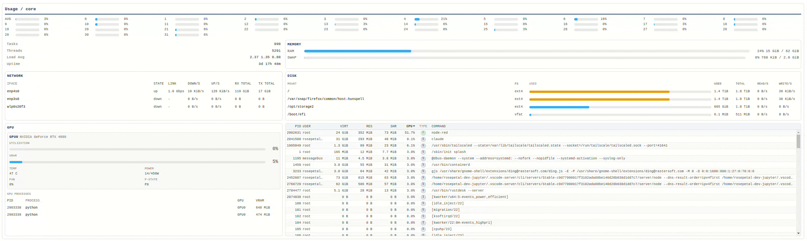

# @rosepetal/node-red-contrib-system-monitor

System monitor widget for **Node-RED Dashboard 2** (Linux-focused, NVIDIA GPU support).



## What it shows

- **CPU**: per-core usage bars, average usage, tasks, threads, load average, uptime.
- **Memory**: RAM and swap usage bars with used/total values.
- **Disk**: mountpoint, filesystem, usage bar, used/total bytes, read/s, write/s.
- **Network**: interface state, link capacity, down/s, up/s, RX total, TX total.
- **GPU (NVIDIA)**: utilization, VRAM usage, temperature, power, fan, p-state, GPU process VRAM.
- **Processes**: htop-style table with PID, user, VIRT, RES, SHR, CPU, state type, command.

## Design goals

- Display-only widget (no inputs/outputs).
- Non-blocking sampling with async reads.
- Delta-based rates for CPU, disk, network, and process CPU.
- Process table is filtered to the **union of top 50** processes by VIRT, RES, SHR, and CPU for efficiency.

## Requirements

- Node.js (same version supported by your Node-RED runtime)
- Node-RED `>= 1.0.0`
- Node-RED Dashboard 2 (`@flowfuse/node-red-dashboard`)
- Linux with `/proc` and `/sys/class/net`
- Optional for GPU: `nvidia-smi` available in PATH

## Install

```bash
npm install @rosepetal/node-red-contrib-system-monitor
```

Or install from the Node-RED Palette Manager using the same package name.

## Node configuration

The widget appears as `system-monitor` in the dashboard category.

Config fields:
- **Group**: Dashboard 2 group where the widget is rendered.
- **Size**: standard Dashboard 2 widget size.
- **Update interval (ms)**: refresh period (minimum effective value is `250 ms`, default `1000 ms`).

## Notes

- GPU section is auto-disabled when NVIDIA tooling is not available.
- Network interface filtering ignores typical virtual/internal interfaces (loopback, docker, veth, etc.).
- Disk section excludes pseudo filesystems.

## Development

```bash
npm install
npm run build
npm run dev
```

## License

Apache-2.0
