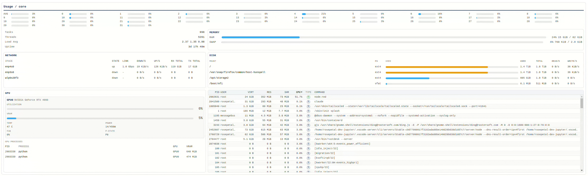

# System Monitor Widget

## Overview

The System Monitor widget is a display-only node for **Node-RED Dashboard 2** that presents real-time system metrics in a single, consolidated view. It has no inputs and no outputs — it reads system state directly from the host and renders six information panels on the dashboard.

The widget is Linux-focused, reading from `/proc` and `/sys/class/net` for core metrics, and optionally querying `nvidia-smi` for GPU data.



## Key Features

- **Display-only**: Zero inputs, zero outputs. Purely a visual dashboard widget.
- **Six monitoring panels**: CPU, Memory, Disk, Network, GPU, and Processes.
- **Non-blocking sampling**: All reads are async; the Node-RED event loop is never blocked.
- **Delta-based rates**: CPU usage, disk I/O, network throughput, and process CPU are computed from deltas between samples.
- **NVIDIA GPU support**: Auto-detected via `nvidia-smi`; gracefully disabled when not available.
- **Configurable refresh rate**: Update interval with a minimum of 250 ms (default 1000 ms).
- **Smart filtering**: Network ignores virtual interfaces; disk excludes pseudo filesystems; processes show a curated top set.

## Requirements

| Requirement | Details |
|---|---|
| Node.js | Same version supported by your Node-RED runtime |
| Node-RED | `>= 1.0.0` |
| Dashboard 2 | `@flowfuse/node-red-dashboard` |
| Operating System | Linux with `/proc` and `/sys/class/net` |
| GPU (optional) | `nvidia-smi` available in `PATH` |

## Installation

```bash
npm install @rosepetal/node-red-dashboard-2-system-monitor
```

Or install from the **Node-RED Palette Manager** by searching for `@rosepetal/node-red-dashboard-2-system-monitor`.

## Configuration

The widget appears as **system-monitor** in the Dashboard category of the Node-RED editor. It registers as `ui-system-monitor`.

| Field | Description | Default |
|---|---|---|
| **Group** | Dashboard 2 group where the widget is rendered. Required. | — |
| **Size** | Standard Dashboard 2 widget size. | — |
| **Update interval (ms)** | How often metrics are refreshed. Values below 250 ms are clamped to 250 ms. | `1000` |

## Panels

### CPU

Displays per-core usage bars with percentage values, plus a summary section:

- **Per-core bars**: One horizontal bar per logical core showing current utilization.
- **Tasks**: Number of running processes (from `/proc` directory entries).
- **Threads**: Total thread count (from `/proc/loadavg`).
- **Load Average**: System load averages (1, 5, and 15 minute).
- **Uptime**: System uptime in human-readable format.

Task and thread counts are refreshed every 5 seconds rather than on every tick, since they change infrequently.

### Memory

Shows RAM and swap usage as horizontal meter bars:

- **RAM**: Used vs total with percentage and byte values.
- **SWAP**: Used vs total with percentage and byte values.

Data is read from `/proc/meminfo`.

### Disk

A table of mounted filesystems with I/O rates:

| Column | Description |
|---|---|
| **Mount** | Mountpoint path (hover shows source device) |
| **FS** | Filesystem type (ext4, xfs, etc.) |
| **Used** | Visual usage bar with percentage |
| **Used** | Used bytes in human-readable format |
| **Total** | Total bytes in human-readable format |
| **Read/s** | Delta-based read throughput per second |
| **Write/s** | Delta-based write throughput per second |

Pseudo filesystems (proc, sysfs, devtmpfs, tmpfs, etc.) are excluded from the listing.

### Network

A table of physical network interfaces:

| Column | Description |
|---|---|
| **Iface** | Interface name |
| **State** | Link state (up/down), color-coded |
| **Link** | Link capacity in Mbps/Gbps |
| **Down/s** | Delta-based receive throughput per second |
| **Up/s** | Delta-based transmit throughput per second |
| **Rx Total** | Total bytes received since boot |
| **Tx Total** | Total bytes transmitted since boot |

Virtual and internal interfaces are filtered out. This includes loopback (`lo`), Docker bridges (`docker*`, `br-*`), virtual Ethernet pairs (`veth*`), and similar non-physical interfaces. Data is sourced from `/sys/class/net`.

### GPU

Shown only when NVIDIA tooling is available. Displays one card per detected GPU:

- **Utilization**: GPU compute utilization bar with percentage.
- **VRAM**: Video memory usage bar with percentage.
- **Temp**: GPU temperature in degrees Celsius.
- **Power**: Current power draw vs power limit in watts.
- **Fan**: Fan speed percentage.
- **P-State**: Current NVIDIA performance state (P0-P12).

Below the GPU cards, a **GPU Processes** table lists processes consuming VRAM:

| Column | Description |
|---|---|
| **PID** | Process ID |
| **Process** | Process name |
| **GPU** | Which GPU the process is running on |
| **VRAM** | VRAM consumed in MiB |

When `nvidia-smi` is not found in `PATH`, the GPU section displays a message indicating that NVIDIA tooling is unavailable and is automatically disabled.

### Processes

An htop-style process table showing the most resource-intensive processes. Column headers for VIRT, RES, SHR, and CPU are clickable to sort (ascending/descending toggle).

| Column | Description |
|---|---|
| **PID** | Process ID |
| **User** | Owner username |
| **VIRT** | Virtual memory size |
| **RES** | Resident (physical) memory size |
| **SHR** | Shared memory size |
| **CPU** | CPU usage percentage (delta-based) |
| **Type** | Process state type |
| **Command** | Command line |

The process list is built from the **union of the top 50 processes** ranked independently by VIRT, RES, SHR, and CPU. This union strategy ensures that both memory-heavy and CPU-heavy processes are always visible without scanning every process on the system.

## Design Notes

### Non-blocking sampling

All metric collection is asynchronous. Each sampler (CPU, Memory, Disk, Network, GPU, Processes) runs concurrently via `Promise.all`-style execution. A `busy` flag prevents overlapping ticks if a sampling cycle takes longer than the configured interval.

### Delta-based rates

CPU percentages, disk read/write throughput, network throughput, and per-process CPU usage are computed by comparing the current sample against the previous sample. This produces accurate instantaneous rates rather than cumulative averages.

### Process filtering

Rather than reading all processes (which can number in the thousands), the sampler collects the top 50 by each of four metrics (VIRT, RES, SHR, CPU) and takes the union. This keeps the data set small enough for efficient rendering while capturing the most relevant processes.

### Task/thread refresh throttling

Task and thread counts are only refreshed every 5 seconds (`TASK_THREAD_REFRESH_MS`), since reading `/proc` directory entries and parsing `/proc/loadavg` for these values is not needed at high frequency.

### Individual sampler error isolation

Each sampler is wrapped in its own try/catch block. If one subsystem fails (e.g., GPU querying errors), the others continue reporting normally. Failures are logged at debug level without disrupting the widget.

## Troubleshooting

| Symptom | Cause | Fix |
|---|---|---|
| Widget shows "Waiting for data..." | First sample has not arrived yet | Wait for at least one update interval to elapse |
| GPU section says unavailable | `nvidia-smi` not in PATH or no NVIDIA GPU | Install NVIDIA drivers and ensure `nvidia-smi` is accessible |
| No network interfaces shown | All interfaces filtered as virtual | Check that physical interfaces exist and are not named with virtual prefixes |
| Disk panel is empty | Only pseudo filesystems mounted | Mount a real filesystem (ext4, xfs, etc.) |
| High CPU from the widget itself | Update interval set too low | Increase the update interval (1000 ms or higher recommended) |
| Processes table seems incomplete | By design, only the top processes are shown | The union-of-top-50 strategy covers the most relevant processes |

## Development

```bash
npm install     # Install dependencies
npm run build   # Build the Vue 3 frontend with Vite
npm run dev     # Development mode with hot reload
```

The frontend is a Vue 3 single-file component (`ui/components/SystemMonitor.vue`) bundled with Vite. The backend consists of modular samplers under `node-red-contrib-system-monitor/lib/` (cpu, memory, disk, network, gpu, processes), each exposing a `create()` factory and a `getMetrics()` method.

### Project structure

```
node-red-contrib-system-monitor/
  system-monitor.js          # Node-RED node registration and tick loop
  system-monitor.html        # Editor UI definition
  lib/
    cpu.js                   # CPU per-core usage from /proc/stat
    memory.js                # RAM and swap from /proc/meminfo
    disk.js                  # Mountpoints and I/O from /proc/mounts, /proc/diskstats
    network.js               # Interface stats from /sys/class/net
    gpu.js                   # NVIDIA GPU via nvidia-smi
    processes.js             # Process table from /proc/[pid]/
ui/
  components/
    SystemMonitor.vue        # Vue 3 dashboard component
```

## License

Apache-2.0
